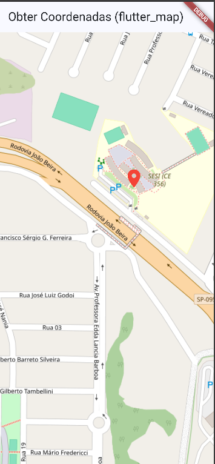

# 📍 Aplicativo de Mapa

Aplicativo desenvolvido em Flutter seguindo o tutorial proposto na atividade. O projeto utiliza o pacote `flutter_map` para exibir um mapa interativo e permite obter as coordenadas de um ponto selecionado.

# 🎯 Objetivo

O aplicativo apresenta um mapa e permite que o usuário clique em um ponto para obter sua localização.

Ao clicar no mapa, são exibidas:

- Latitude
- Longitude
- Marcador no ponto selecionado

# Aplicativo funcionando



# Tecnologias utilizadas
- Flutter
- Dart
- Google Chrome
- Mapa
- GitHubk
- flutter_map
- OpenStreetMap
- latlong2
- Google Chrome

# Como executar
Antes de executar o projeto, é necessário ter instalado:

- Flutter
- Dart
- Visual Studio Code
- Google Chrome  

# Clone o repositório
```
git clone https://github.com/MoniqueBabler/flutter_map_nativo.git

ENTRE NA PASTA
cd flutter_masp_nativo

INSTALE AS DEPENDÊNCIAS
flutter pub get

EXECUTE O APP NO GOOGLE CHROME
flutter run -d chrome

```
# Teste o mapa
- Aguarde o carregamento do mapa.
- Clique em qualquer ponto do mapa.
- Um marcador vermelho aparecerá no local selecionado.
- A latitude e a longitude serão exibidas na tela.